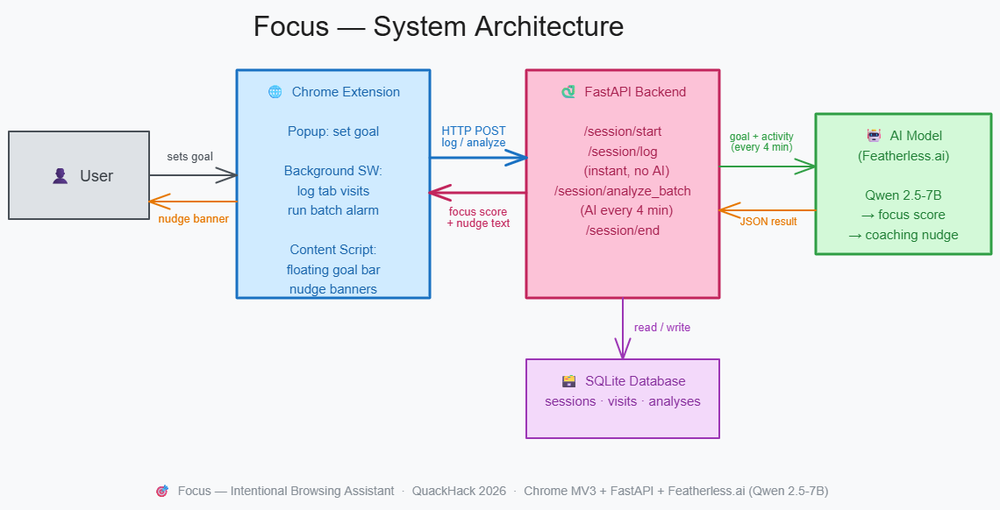

# 🎯 Focus — Intentional Browsing Assistant

A Chrome Extension + FastAPI backend that uses an LLM to keep you aligned with your browsing goal in real time.



> **Built for QuackHack 2026 · 24-hour hackathon**

---

## What It Does

1. You set a **focus goal** in the Chrome popup (e.g. *"Research machine learning"*)
2. As you browse, the extension sends each URL to the backend
3. The backend uses an **LLM (Featherless.ai / Qwen2.5-7B)** to check alignment
4. A **floating goal bar** on every page shows whether you're on-track or off-track

---

## Tech Stack

| Layer | Tech |
|-------|------|
| Extension | Chrome Manifest V3, React 18, Webpack 5 |
| Backend | Python · FastAPI · SQLite · OpenAI SDK |
| AI | Featherless.ai (Qwen/Qwen2.5-7B-Instruct) |

---

## Setup

### Prerequisites
- Python 3.8+
- Node.js 16+
- A free [Featherless.ai](https://featherless.ai) API key

---

### 1 · Backend

```bash
cd backend

# Create & activate virtual environment
python -m venv .venv

# Windows
.venv\Scripts\activate
# macOS / Linux
source .venv/bin/activate

# Install dependencies
pip install -r requirements.txt

# Configure environment
# Create a .env file with the following contents:
#   FEATHERLESS_API_KEY=your_api_key_here
#   EXTENSION_SECRET_KEY=hackathon-focus-123

# Start the server
uvicorn main:app --reload --host 0.0.0.0 --port 8000
```

API runs at `http://localhost:8000` · Docs at `http://localhost:8000/docs`

---

### 2 · Frontend (Chrome Extension)

```bash
cd frontend

npm install
npm run build      # one-time production build
# or: npm run dev  # watch mode during development
```

**Load into Chrome:**
1. Go to `chrome://extensions`
2. Enable **Developer Mode** (top-right)
3. Click **Load unpacked** → select the `frontend/` folder
4. Pin the extension and click the icon

---

## API Endpoints

| Endpoint | Method | Description |
|----------|--------|-------------|
| `/api/v1/session/start` | POST | Start session with a goal |
| `/api/v1/session/log` | POST | Log a tab visit (fast, no AI) |
| `/api/v1/session/analyze_batch` | POST | Batch analyze activity (AI every 4 min) |
| `/api/v1/session/end` | POST | End session |
| `/health` | GET | Health check |

> All endpoints require the `X-Extension-Key` header matching `EXTENSION_SECRET_KEY`.

---

## Why Focus Matters

The browser is our most-used productivity tool, but it lacks any built-in accountability. The "Focus" assistant provides a real-time accountability layer to help you stay aligned with your deep work goals.

---

## Technical Architecture & Challenges

### 🚀 Batch Analysis for Context & Cost
Calling an LLM on every tab switch is computationally expensive and lack context. We implemented a **Batch Processing** model:
- The extension logs visits instantly to a "fast-path" `/session/log` endpoint.
- Every 4 minutes, the background script triggers `/session/analyze_batch`.
- This provides the AI with a full context window of your recent behavior (URLs, titles, and DOM snippets) to make a far more accurate "on-track" judgement.

### 💾 Persistent Service Worker State (MV3)
Chrome Manifest V3 background scripts are ephemeral and can be suspended at any time. To prevent losing session data or timing progress:
- We leverage `chrome.storage.session` for high-frequency state persistence.
- A robust `withSession()` wrapper ensures the state is rehydrated automatically whenever the Service Worker wakes up.

### 🤖 Precise Analysis via DOM Scraping
Instead of relying solely on URLs (which can be ambiguous), our content scripts perform lightweight **DOM scraping** to extract page titles and semantic snippets, providing the Qwen-2.5-7B model with enough data to distinguish between "Researching ML" on GitHub and "Browsing random repos."

---

## Project Structure

```
Focus/
├── backend/
│   ├── main.py          # FastAPI app & batch processing logic
│   ├── database.py      # SQLite persistence layer
│   ├── models.py        # Pydantic validation schemas
│   ├── requirements.txt
│   └── .env             # API keys (not committed)
└── frontend/
    ├── background/background.js   # Service worker & session management
    ├── content/content.js         # UI overlay & DOM extraction
    ├── popup/                     # React popup UI
    └── manifest.json              # Chrome MV3 configuration
```